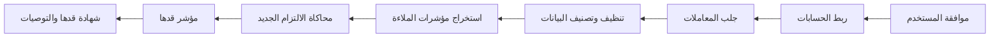

<div dir="rtl" align="right">
https://qadaha.vercel.app رابط التطبيق

## قدها | Qaddha

**قدها** منصة ملاءة مالية مبنية على المصرفية المفتوحة، تساعد المستخدمين، خصوصًا أصحاب الدخل غير المنتظم مثل المستقلين وأصحاب المشاريع الصغيرة، على معرفة قدرتهم المالية قبل الدخول في التزامات جديدة مثل التمويل أو التقسيط أو الإيجار.

بدل مشاركة كشف حساب كامل مع جهة تمويلية، تحلل قدها التدفقات النقدية والالتزامات بعد موافقة المستخدم، ثم تصدر **مؤشر ملاءة** و**شهادة قدها** المختصرة القابلة للمشاركة، مع تفسير واضح للنتيجة وتوصيات عملية لتحسين القدرة المالية.

> **تنبيه:** شهادة قدها ليست تقريرًا ائتمانيًا رسميًا ولا بديلًا عنه. هي مؤشر داعم مبني على التدفق النقدي يساعد المستخدم والجهات المالية على فهم القدرة على الالتزام بشكل أوضح.

---

## الفكرة باختصار

كثير من أصحاب الدخل غير المنتظم لديهم قدرة مالية جيدة، لكن دخلهم لا يظهر دائمًا بشكل ثابت في التقييمات التقليدية. وفي المقابل، مشاركة كشف الحساب الكامل تكشف تفاصيل مالية حساسة لا تحتاج الجهة التمويلية إلى الاطلاع عليها.

تقدم قدها حلًا وسطًا: تحليل ذكي للتدفق النقدي، ثم شهادة مختصرة تعرض القدرة المالية دون كشف التفاصيل الكاملة للحساب.

---

## المشكلة التي يحلها المشروع

- صعوبة تقييم أصحاب الدخل غير المنتظم قبل التمويل أو التقسيط.
- الاعتماد على متوسط الدخل وحده دون فهم التذبذب والاستقرار النقدي.
- مشاركة كشف الحساب الكامل مع جهات خارجية رغم حساسية البيانات.
- عدم وضوح سبب القبول أو الرفض المتوقع للمستخدم.
- غياب أداة مبسطة تقول للمستخدم: هل أنت قدّ الالتزام الجديد؟

---

## الحل المقترح

تعتمد قدها على ربط الحسابات عبر نموذج يحاكي المصرفية المفتوحة، ثم تحليل معاملات المستخدم واستخراج مؤشرات مالية رئيسية، مثل:

- متوسط الدخل الشهري.
- تذبذب الدخل.
- الالتزامات المتكررة.
- الفائض النقدي بعد المصاريف.
- استقرار الرصيد.
- أثر القسط أو الالتزام الجديد على التدفق النقدي.

بعد ذلك يصدر النظام:

- **مؤشر قدها** من 0 إلى 100.
- تصنيف الملاءة: مناسب، مناسب بحذر، أو غير مناسب حاليًا.
- تفسير مختصر لأسباب النتيجة.
- توصيات لتحسين القدرة المالية.
- **شهادة قدها** قابلة للمشاركة بدل كشف الحساب الكامل.

---

## رحلة المستخدم

1. يوافق المستخدم على ربط الحسابات وتحديد صلاحيات التحليل.
2. يتم جلب بيانات الحساب والمعاملات من خلال Mock Open Banking API.
3. تُنظف البيانات وتُصنف إلى دخل، مصاريف، التزامات، اشتراكات، وتحويلات.
4. يستخرج النظام مؤشرات التدفق النقدي والملاءة.
5. يدخل المستخدم قيمة الالتزام الجديد، مثل قسط شهري أو تمويل.
6. يحسب النظام أثر الالتزام على القدرة المالية.
7. تظهر نتيجة مؤشر قدها مع تفسير وتوصيات.
8. يمكن إصدار شهادة قدها المختصرة ومشاركتها.



---

## الواجهات الرئيسية

### 1. لوحة التحكم

تعرض نظرة عامة على الوضع المالي للمستخدم، مثل الدخل، المصاريف، الالتزامات، ومؤشر الملاءة الحالي.

### 2. ربط الحسابات

واجهة موافقة وربط حسابات تجريبية لمحاكاة المصرفية المفتوحة، مع توضيح الصلاحيات المطلوبة للتحليل.

### 3. تحليل التدفق المالي

تعرض تحليل الدخل والمصاريف والالتزامات، وتوضح اتجاهات الرصيد والتدفق النقدي خلال الفترة السابقة.

### 4. محاكي الالتزام

يسمح للمستخدم بإدخال التزام جديد مثل قسط شهري أو تمويل، ثم يحسب النظام أثره على الملاءة المالية.

### 5. شهادة قدها

تعرض نتيجة الملاءة، التصنيف، أهم العوامل المؤثرة، والتوصية النهائية في شهادة مختصرة قابلة للمشاركة.

### 6. شات قدها

مساعد ذكي يشرح للمستخدم نتيجة الملاءة، يجيب عن أسئلته المالية، ويقترح خطوات تحسين.

### 7. خطة التحسين المالي

تعرض خطة عملية لتحسين مؤشر قدها، مثل تقليل المصاريف الاختيارية، رفع الفائض الشهري، أو اختيار قسط أقل.

---

## التقنيات المستخدمة

### Frontend

- React
- TypeScript
- Vite
- React Router
- Tailwind CSS
- Recharts
- Motion
- Lucide React

### AI & Data Layer

- Random Forest Classifier لتصنيف الملاءة المالية.
- pandas و numpy لمعالجة البيانات واستخراج المؤشرات.
- scikit-learn لتدريب النموذج وتقييمه.
- joblib لحفظ النموذج وإعادة تحميله.
- SHAP لتفسير قرارات النموذج وإظهار العوامل المؤثرة.
- Gemini API لاستخدام مساعد ذكي يشرح النتائج ويولّد توصيات بلغة واضحة.

### Open Banking Simulation

- Mock Open Banking API لمحاكاة ربط الحسابات وجلب المعاملات بعد موافقة المستخدم.
- بيانات مصرفية تجريبية مولدة بدل البيانات الحقيقية.
- تقليل البيانات المعروضة عند إصدار شهادة الملاءة.

---

## هيكل المشروع

```text
qadaha/
├── project_app/                 # تطبيق الواجهة الأمامية
│   ├── src/
│   │   ├── components/          # مكونات مشتركة مثل Layout و Sidebar و TopNav
│   │   ├── pages/               # صفحات التطبيق الرئيسية
│   │   │   ├── Dashboard.tsx
│   │   │   ├── CashFlow.tsx
│   │   │   ├── Simulator.tsx
│   │   │   ├── Certificate.tsx
│   │   │   ├── Chat.tsx
│   │   │   └── ImprovementPlan.tsx
│   │   ├── App.tsx
│   │   └── main.tsx
│   ├── package.json
│   └── vite.config.ts
│
└── model/
    └── qadaha-ai/               # مساحة عمل نموذج الملاءة المالية
```

---

## نموذج الملاءة المالية

يعتمد نموذج قدها على مؤشرات مالية مستخرجة من معاملات الحساب، ثم يصنف قدرة المستخدم على تحمل التزام جديد.

### أمثلة على مدخلات النموذج

```json
{
  "avg_monthly_income_6m": 12000,
  "income_volatility_score": 0.34,
  "monthly_obligations": 3200,
  "obligation_to_income_ratio": 0.27,
  "avg_monthly_surplus": 2800,
  "minimum_monthly_balance": 900,
  "low_balance_months_count": 2,
  "proposed_installment_amount": 1200,
  "new_obligation_to_income_ratio": 0.37,
  "installment_to_surplus_ratio": 0.43
}
```

### أمثلة على مخرجات النموذج

```json
{
  "qaddha_score": 74,
  "status": "مناسب بحذر",
  "safe_installment_limit": 950,
  "main_reasons": [
    "الدخل جيد لكنه متذبذب",
    "القسط الجديد يرفع الالتزامات إلى 37% من متوسط الدخل",
    "حدث انخفاض في الرصيد خلال شهرين من آخر 6 أشهر"
  ],
  "recommendations": [
    "اختيار قسط لا يتجاوز 950 ريال",
    "بناء احتياطي نقدي قبل التقديم",
    "تقليل المصاريف الاختيارية لمدة شهرين"
  ]
}
```

---

## الخصوصية والأمان

تتعامل قدها مع البيانات المالية بمنطق تقليل البيانات وحماية الخصوصية:

- لا يتم استخدام رقم الهوية الوطنية في النموذج الأولي.
- لا يتم عرض الآيبان الكامل أو تفاصيل الحساب الحساسة.
- تعتمد الشهادة على مؤشرات مختصرة بدل كشف الحساب الكامل.
- مشاركة الشهادة تتم بموافقة المستخدم.
- البيانات المستخدمة في النموذج الأولي بيانات تجريبية مولدة.

---

## تشغيل التطبيق محليًا

### المتطلبات

- Node.js
- npm
- مفتاح Gemini API في حال تشغيل ميزات الشات الذكي

### خطوات التشغيل

```bash
# 1. استنساخ المستودع
git clone https://github.com/hamed7177-pro/qadaha.git

# 2. الدخول إلى تطبيق الواجهة
cd qadaha/project_app

# 3. تثبيت الاعتماديات
npm install

# 4. إنشاء ملف البيئة
cp .env.example .env.local

# 5. إضافة مفتاح Gemini API داخل .env.local
# GEMINI_API_KEY=your_api_key_here

# 6. تشغيل التطبيق
npm run dev
```

بعد التشغيل، افتح المتصفح على:

```text
http://localhost:3000
```

---

## أوامر التطوير

```bash
# تشغيل بيئة التطوير
npm run dev

# بناء نسخة الإنتاج
npm run build

# معاينة نسخة الإنتاج
npm run preview

# فحص TypeScript
npm run lint
```

---

## حالة المشروع

هذا المشروع نموذج أولي تم تطويره لأغراض الهاكاثون، ويركز على إثبات الفكرة وتجربة المستخدم قبل التكامل مع بيانات مصرفية حقيقية.

### المنجز حاليًا

- واجهات عربية RTL لتجربة قدها.
- صفحات رئيسية للوحة التحكم، تحليل التدفق، المحاكي، الشهادة، الشات، وخطة التحسين.
- تصور تقني لنموذج الملاءة المالية.
- تجربة مستخدم توضح رحلة إصدار شهادة قدها.

### المرحلة القادمة

- ربط الواجهة بنموذج الملاءة الفعلي.
- بناء Mock Open Banking API أكثر اكتمالًا.
- توليد بيانات مصرفية تجريبية متنوعة.
- تدريب Random Forest Classifier على سيناريوهات مالية متعددة.
- إضافة SHAP لتفسير النتيجة داخل الواجهة.
- تحسين شهادة قدها لتكون قابلة للمشاركة بصيغة PDF أو رابط آمن.

---

## ملاءمة المشروع لمسار المصرفية المفتوحة

قدها لا تكتفي بعرض بيانات الحساب، بل تحول بيانات المصرفية المفتوحة إلى قرار مالي قابل للفهم. الفكرة تجمع بين:

- المصرفية المفتوحة.
- تحليل البيانات المالية.
- الذكاء الاصطناعي القابل للتفسير.
- حماية الخصوصية.
- تحسين تجربة المستخدم قبل التمويل أو التقسيط.

الهدف النهائي هو بناء طبقة ثقة بين المستخدم والجهة المالية: المستخدم يفهم قدرته، والجهة المالية تحصل على شهادة مختصرة داعمة دون الحاجة إلى كشف كامل للتفاصيل البنكية.

---

## ملاحظة تنظيمية

قدها تقدم مؤشر ملاءة مبنيًا على التدفق النقدي، ولا تقدم قرارًا ائتمانيًا رسميًا. أي تطبيق فعلي يتطلب مراجعة تنظيمية، تكاملًا مع مزودي خدمات مرخصين، وتوافقًا مع متطلبات المصرفية المفتوحة وحماية البيانات.

---

## اسم المشروع

**قدها**

> اعرف قدرتك قبل الالتزام.

</div>
